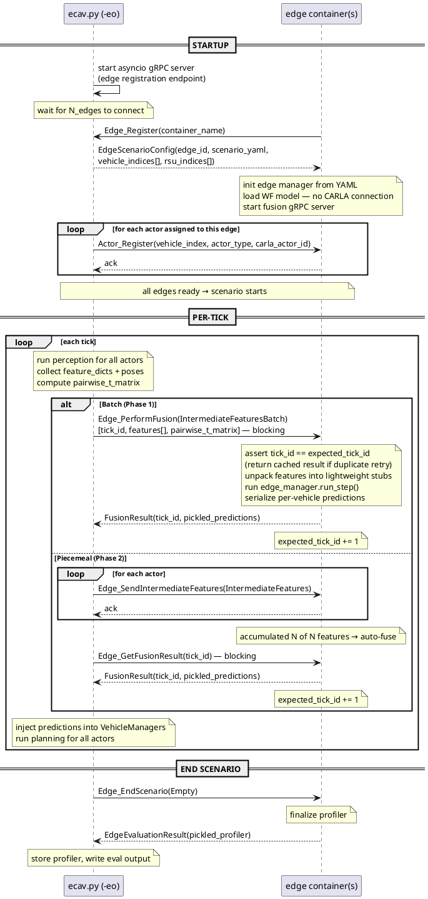

# Edge-Only Distributed Mode

**Branch:** `distributed-integration`  
**Status:** Planning  
**Created:** 2026-05-09  
**Relates to:** `docs/agent_plans/multi_edge_locale_handoff.md`

---

## Context

The primary research object is the edge node — its fusion pipeline, latency characteristics, and handoff behavior. The current simulation has two modes: fully-sequential (all actors in-process, no gRPC) and fully-distributed (all actors in Docker containers). Neither is right for edge-focused research:

- Fully-sequential: no network isolation, can't profile edge in realistic conditions
- Fully-distributed: adds Docker + gRPC overhead to the vehicle path, which is not the research focus

Edge-only distributed mode keeps edges in Docker containers (realistic, isolated, profilable) while the vehicle and RSU(s) run in the base process (sequential-style, zero extra overhead). This is also the structural prerequisite for Model C handoff (orchestrator-driven) in the multi-edge locale plan, where `ecav.py` directly queries CARLA positions and routes vehicle data to whichever edge owns the current locale.

---

## Architecture Decision: Edge as a Pure Fusion Service

The current fully-distributed actor protocol is heavy: actor registration, push servers, tick synchronization via C++ orchestrator. None of that machinery is needed when the vehicle runs in the base process — the base process already owns the tick loop and has direct CARLA access.

In edge-only mode the edge is a **pure fusion service**, not a tick-synchronization participant:

- **No C++ orchestrator** — `ecav.py` hosts a lightweight asyncio gRPC server for edge registration. Edges connect to it on startup; it assigns each an edge ID and sends the scenario config. One hop instead of two.
- **No tick push** — the edge sits idle until `Edge_PerformFusion` arrives. It does not receive `Edge_PushTick` and does not call `Edge_TickComplete`. The tick loop is driven entirely by `ecav.py`.
- **No CARLA connection in the edge container** — actor positions travel in the `IntermediateFeatures.pose` field. `ecav.py` also pre-computes `pairwise_t_matrix` from actor poses before calling `Edge_PerformFusion`, so the edge does zero coordinate math. No `carla.Client()`, no PythonAPI volume mount.
- **Tick-ID tracking for idempotency** — the edge asserts each incoming `tick_id == expected_tick_id`. On a gRPC retry (same tick_id), it returns the cached `FusionResult`. After a successful fusion it increments `expected_tick_id`.

Two update modes are supported:

- **Batch (Phase 1)** — `ecav.py` collects all actor features, packs them into a single `IntermediateFeaturesBatch`, and calls `Edge_PerformFusion` as a blocking RPC. The sequential tick loop has nothing else to do while fusion runs, so blocking is the right semantic.
- **Piecemeal (Phase 2)** — individual `Edge_SendIntermediateFeatures` calls per actor, followed by a blocking `Edge_GetFusionResult`. Needed when actors eventually run concurrently. All three RPCs are already defined in `ecloud.proto`; only the handlers are missing.

This is also the right shape for the handoff plan: in Model C, `ecav.py` just routes `Edge_PerformFusion` calls to whichever `EdgeFusionClient` owns the vehicle's current locale. No new infrastructure at handoff time.

---

## Data Flow



---

## What Changes

### 1. `ecav/ecav2/edge_process.py`

**Registration:** Connect to ecav.py's gRPC server (same `Edge_Register` RPC, different host). Remove `--edge-index`, `--standalone`, `--config` args — the edge ID and scenario config come from the registration response. `cloud_config.yaml` already provides the host IP.

**Fusion handler:** Implement `Edge_PerformFusion` in `EdgeServer`:

- Assert `tick_id == expected_tick_id`; return cached result if it's a retry
- Unpack `IntermediateFeatures` into lightweight stubs (just `feature_dict` + `pose` — no proxy VehicleManagers, no CARLA)
- Call `edge_manager.run_step(tick_id)` — the existing implementation
- Serialize per-vehicle predictions into `FusionResult.pickled_predictions`
- Increment `expected_tick_id`

**End handler:** Implement `Edge_EndScenario` — finalize profiler, return `EdgeEvaluationResult`.

**No CARLA init:** `setup_edge_manager()` no longer calls `carla.Client()`. Actor stubs are populated from `IntermediateFeatures.pose`, not from world queries.

The existing actor-protocol code (`Edge_PushTick`, `Edge_TickComplete`, etc.) is **unchanged** — the new code is additive.

### 2. `ecav.py`

Add `-eo` flag. When set:

- Start asyncio gRPC server for edge registration
- Handle `Edge_Register` RPC — assign IDs sequentially, send scenario YAML + vehicle/RSU assignments
- Wait for all expected edges to register
- Register actors with their assigned edges (`Actor_Register` per actor)
- Create `EdgeFusionClient(s)` — one per edge
- Skip C++ `ecloud_server` subprocess

### 3. New `ecav/scenario_testing/utils/edge_fusion_client.py`

`EdgeFusionClient`:

- gRPC stub wrapping `Edge_PerformFusion`
- `connect(edge_ip, edge_port, retry_timeout_s)` — retry loop until edge is reachable
- `fuse(tick_id, features_batch) → FusionResult`
- One client per edge; handoff plan just routes to a different client based on locale

### 4. Scenario `.py` files (new branch in `run_scenario()`)

```python
# Sequential path (unchanged):
for step in range(MAX_STEP):
    edge.run_step(step)      # perception → local fusion → planning

# Edge-only distributed path (new):
for step in range(MAX_STEP):
    batch   = edge.collect_features(step)           # perception only, returns IntermediateFeaturesBatch
    result  = fusion_client.fuse(step, batch)       # blocking RPC to edge container
    edge.apply_predictions(step, result)            # inject predictions → planning
```

**Files to update:** `openscenario_3_edge_worldfusion.py`, `openscenario_3_edge_late_fusion.py`.

### 5. `ecav/core/application/edge/edge_manager/` (WorldFusion and LateFusion)

Split `run_step()` at the confirmed boundary:

- `collect_features(step)` → runs `update_information(step)`, builds and returns `IntermediateFeaturesBatch` (includes all actor poses so `pairwise_t_matrix` can be computed by ecav.py before the RPC)
- `apply_predictions(step, fusion_result)` → injects predictions, runs `_update_agents(step, preds)` → planning/control

### 6. `ecav/protos/ecloud.proto`

See **Proto Changes** section below.

### 7. `start_actors.sh`

In edge-only mode:

- Spawn edge containers with no `--edge-index` (assigned at registration)
- Do **not** start vehicle or RSU containers
- Wait for ecav.py's "all edges ready" signal (not a per-edge gRPC health check)
- Rebuild container prompt still applies

---

## What Does NOT Change

- `ecav/ecav2/edge_process.py` actor protocol (non-standalone mode is untouched)
- `ecav/ecloud_server/` — C++ server unchanged
- Existing fully-distributed scenarios (they still use the old code path)
- `stop_actors.sh`

## Proto Changes Required

**Field addition — `FusionResult`:**

```proto
message FusionResult {
  int32 tick_id = 1;
  repeated EdgeObstacleObject detections = 2;
  float communication_rate = 3;
  int64 fusion_time_ns = 4;
  bytes pickled_predictions = 5;  // ADD THIS: per-vehicle ObstaclePrediction objects
}
```

The existing `detections` field carries `EdgeObstacleObject` proto structs, not the pickled `ObstaclePrediction` objects the planning pipeline expects. Field 5 carries those pickled predictions so `ecav.py` can inject them into `VehicleManager.update_info()` after `Edge_PerformFusion` returns.

**New RPC — `Edge_EndScenario`:**

```proto
rpc Edge_EndScenario(Empty) returns (EdgeEvaluationResult);
```

`ecav.py` calls this at scenario end; the edge finalizes its profiler and returns it as the response. The existing `Edge_SendEvaluationData` RPC (edge pushes to orchestrator) is the distributed-mode equivalent and is unchanged.

**Already defined, handlers only (Phase 2 piecemeal mode):**

- `rpc Edge_SendIntermediateFeatures(IntermediateFeatures) returns (Empty)` — per-actor feature push
- `rpc Edge_GetFusionResult(IntermediateFeaturesRequest) returns (FusionResult)` — blocking result fetch

After any proto change, recompile: `python ecav.py --build`.

---

## Risks & Open Questions

| Risk | Mitigation |
|------|-----------|
| `run_step()` split: perception and planning are interleaved in complex ways inside EdgeManager | The split point is confirmed: `update_information(tick)` → fusion → `_update_agents(tick, preds)`. Phase 2 splits these into `collect_features()` + `apply_predictions()`. WorldFusion first. |
| `IntermediateFeaturesBatch.pairwise_t_matrix` format: must match what the WorldFusion model expects | `ecav.py` computes from actor poses before the RPC call; edge just unpacks and passes to the model. `pairwise_t_matrix_shape` field already present in proto. |
| RSU perception data must be included in the fusion batch | In edge-only mode, RSU runs locally in the base process. Its `feature_dict['spatial_features']` must be included in the `IntermediateFeaturesBatch` alongside vehicle features. |
| `Edge_PerformFusion` handler: reference implementation exists | `run_edge_step()` in edge_process.py (committed 787f4dac) is the direct reference — it already does feature unpack + `edge_manager.run_step()` + per-vehicle prediction serialization. The handler is a standalone-mode wrapper around this same logic. |

---

## Implementation Checklist

### Phase 0: Exploration

- [x] Read `ecav/core/application/edge/edge_manager/edge_manager_worldfusion_ab3dmot_linear_predictor.py` — understand `run_step()` fully
- [x] Read `ecav/core/sensing/perception/worldfusion_perception_manager.py` — understand `IntermediateFeaturesBatch` fields and feature extraction
- [x] Confirm RSU features flow through the same path as vehicle features (yes — `update_information()` iterates all members including RSUs; `run_edge_step()` in 787f4dac handles both actor types)
- [x] Confirm `Edge_PerformFusion` RPC is defined in proto (yes, line 476; `EdgeServer` has no handler yet)
- [x] Identify `FusionResult` proto gap: needs `bytes pickled_predictions = 5` (current fields 1-4 only)

### Phase 1: Edge Fusion Service

- [x] Add `bytes pickled_predictions = 5` to `FusionResult` in `ecloud.proto`
- [x] Add `rpc Edge_EndScenario(Empty) returns (EdgeEvaluationResult)` to `ecloud.proto`
- [x] Recompile stubs: `python ecav.py --build` (also fixed `--build` requiring a scenario arg — hoisted check to top of `main()`)
- [x] Add `Edge_PerformFusion` handler to `EdgeServer` in `edge_process.py` — `_FeatureStub` for duck-typed actor stubs, inject into edge_manager lists, call `run_step()`
- [x] Add `Edge_EndScenario` handler to `EdgeServer` — finalize profiler, return `EdgeEvaluationResult`
- [x] Add tick-ID tracking to `EdgeProcess` (`expected_tick_id`, `_last_fusion_result` for idempotent retries)
- [x] Add `--standalone` / `--config` args and `_run_standalone()` path (skips orchestrator, loads YAML from file, inits edge manager without CARLA) — `_setup_edge_manager_standalone()` uses `world=None, carla_client=None`
- [x] Guard unguarded `self.world.get_actors()` in `WorldFusionEdge.run_step()` with `if self.world is not None:`
- [x] Change `register_with_orchestrator()` to connect to ecav.py's gRPC server instead of C++ server — no code change needed: it uses `orchestrator_ip`/`orchestrator_port` CLI args; in edge-only mode those point at `EdgeRegistrationServer` (port 50055); `run()` branches on `carla_ip==""` after registration
- [x] Test: start edge process in `--standalone` mode, call `Edge_PerformFusion` via `test_edge_standalone.py` — PASSED (2026-05-30): empty batch → early return, idempotency gate, Edge_EndScenario profiler (75 keys)

### Phase 2: Base Process Client

- [x] Add `-eo` / `--edge_only` flag + `--edge_reg_port` to `ecav/ecav2/arg_utils.py`
- [x] Write `ecav/scenario_testing/utils/edge_registration_server.py` — asyncio gRPC server handles `Edge_Register`, assigns sequential IDs, sends `EdgeScenarioConfig` (carla_ip="" signals no-CARLA to edge), signals completion when all edges registered
- [x] Write `ecav/scenario_testing/utils/edge_fusion_client.py` — `EdgeFusionClient` with retry-connect, `fuse()`, `end_scenario()`, `close()`
- [x] Add `WorldFusionEdge.collect_features(step)` — drives `update_information()`, serializes features + poses into `IntermediateFeaturesBatch` (RSUs first)
- [x] Add `WorldFusionEdge.apply_predictions(step, fusion_result)` — unpacks pickled predictions from `FusionResult`, injects into vehicle managers, runs planning + control
- [x] Add `-eo` branch to `openscenario_3_edge_worldfusion.py`: registration server startup + `collect_features/fuse/apply_predictions` tick loop + `end_scenario`/`close` teardown
- [x] `edge_process.py` `run()`: after `register_with_orchestrator()`, if `carla_ip==""` → use `_setup_edge_manager_standalone()` path (no CARLA, no actor wait, serve fusion RPCs)

### Phase 3: Launch Script

- [x] Update `start_actors.sh`: spawn edges with `--orchestrator_ip localhost --orchestrator_port 50055` (no `--edge-index`); skip vehicle/RSU/non-ego containers in edge-only mode; use port base 50060 for fusion servers
- [x] Replace "pushed scenario start" wait with mode-aware signals: wait for "EdgeRegistrationServer" before starting edges, then `[EDGE-ONLY]` after all edges connected
- [x] Test: `openscenario_3_edge_worldfusion` end-to-end in edge-only distributed mode — PASSED (2026-05-31 / 2026-06-01)

### Phase 4: Verification

- [x] Confirm vehicle drives successfully using edge-fused predictions — ✓ (2026-05-31: `avg_speed_mps=9.94`, `ghost_brake_events=0`, `true_positive_gt=8`; JRapp confirmed live)
- [x] Confirm edge profiler logs are written (`edge_profiler_<ts>.json`) — ✓ (profiler 75 keys confirmed in standalone test 2026-05-30; e2e confirmed 2026-05-31)
- [x] Confirm late-fusion scenario also works (same code path, different edge config) — ✓ (2026-05-31 fix + run; re-validated post-develop-merge 2026-06-01)

---

## Relationship to Handoff Plan

`EdgeFusionClient` is the primitive the handoff plan builds on. For Model C:

```python
# ecav.py per-tick (Model C handoff — future):
for vehicle_idx, vehicle in vehicles.items():
    edge_idx = locale_map.containing_edge(vehicle.get_transform().location)
    fusion_result = fusion_clients[edge_idx].fuse(step, collect_features(vehicle))
    apply_predictions(vehicle, fusion_result)
```

No new infrastructure at handoff time — just routing to a different `EdgeFusionClient`. The "handoff gap" (cold-start tracking state on the new edge) is directly observable.
